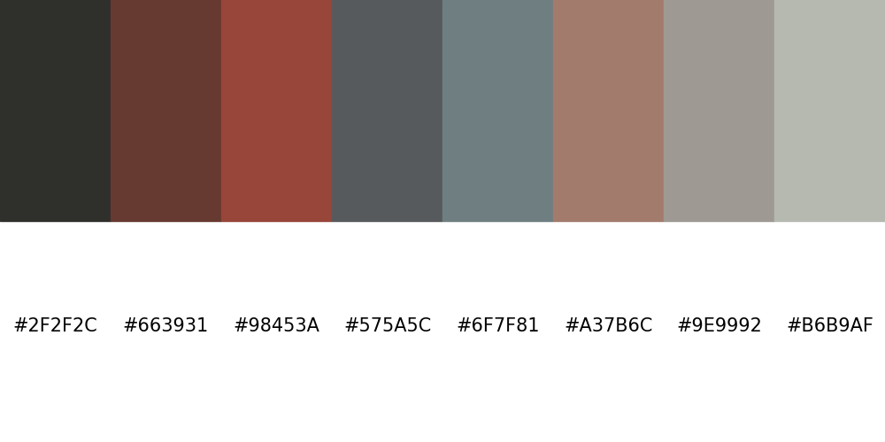

# colorpal
A lightweight script to extract color palettes from an image




## Requirements
```
matplotlib==1.5.3
numpy==1.13.0
Pillow==6.2.0
scikit_learn==0.21.3
```

## Installation
Clone this repository then install packages:
```
git clone https://github.com/luke0321li/colorpal.git
cd colorpal
pip install -r requirements.txt
```

## Usage
```
usage: colorpal.py [-h] [-i [INPUT_PATH]] [-c [COLOR_NUM]]

optional arguments:
  -h, --help            show this help message and exit
  -i [INPUT_PATH], --input_path [INPUT_PATH]
                        Input image file path
  -c [COLOR_NUM], --color_num [COLOR_NUM]
                        Number of colors in the palette, default 8
```
Running the script opens up a plot showing the color palette. Close the image to exit.